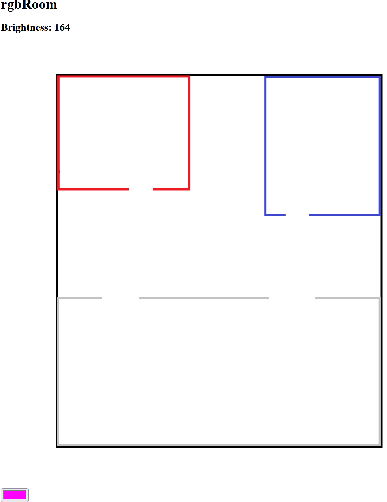

# Smart Lighting
by Jonathan Abel

## Smart Site!
This amazing website helps you to control your lights in an easy to use way! Just click on the room on the website and the lights are on! The brightness meter also shows the ambient light in the room so you know when to turn your lights on! The webpage updates automatically with the last room you turn on!

{width=268 height=347}

Psst... There is also RGB controls on the webpage for the most party like atmosphere you'd like!

## Smart Controls!
The system comes prepackaged with local controls that will update the website as you go. Just turn the Rotary Encoder to choose the Light to turn on and click in on the stick to turn it on! You can change the brightness on the website by covering the photoresistor! Current brightness updates as you scroll the wheel. Buy today!

